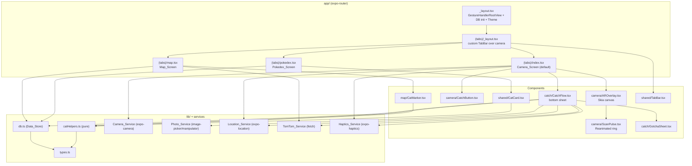
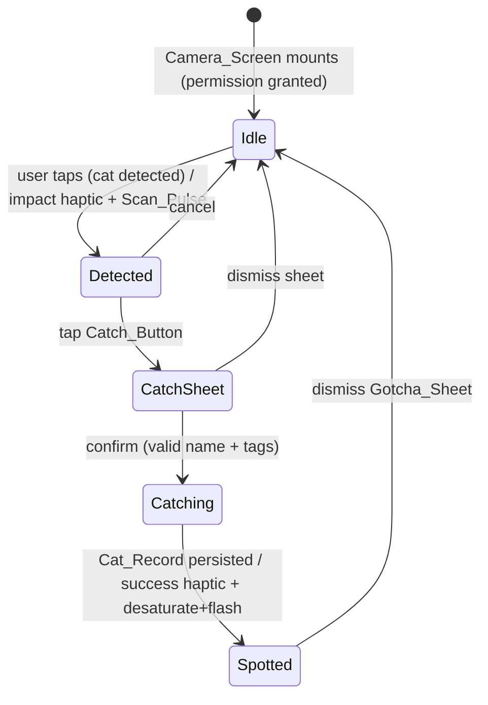
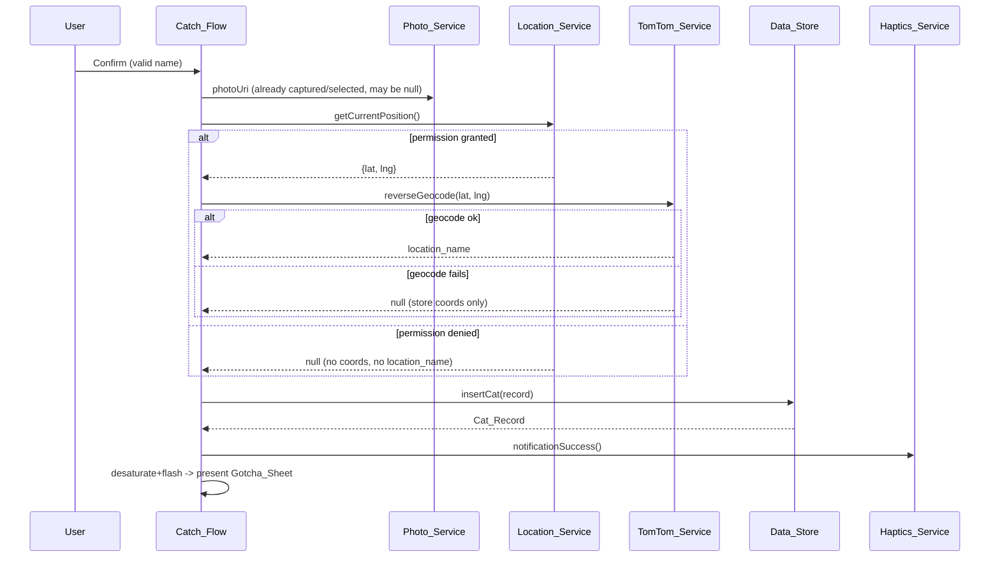

# Design Document

## Overview

Pokecat is a camera-first Expo React Native app (Expo SDK 57) that reimagines Pokémon-GO-style catching for cataloging stray cats. When the app opens, the live back camera fills the screen behind a Skia-rendered AR targeting overlay. A floating dark-glass tab bar and action row hover over the feed. Tapping the center Catch_Button raises a bottom sheet where the user names and tags a cat, captures/resizes a photo, records GPS coordinates, reverse-geocodes them into a place name, and persists everything to a local SQLite database. A "SPOTTED!" moment rewards the catch with haptics. A map view renders every sighting over TomTom night-style vector tiles via MapLibre, and a Pokédex grid browses the roster.

This design targets the **actual installed stack** and follows the [Expo v57 documentation](https://docs.expo.dev/versions/v57.0.0/) per the workspace rule:

- **Expo SDK** `~57.0.7`, **React Native** `0.86.0`, **React** `19.2.3`
- **expo-router** `~57.0.7` (file-based routing, typed routes enabled)
- **react-native-reanimated** `4.5.0` + **react-native-worklets** `0.10.0` (Reanimated 4 *requires* worklets)
- **@shopify/react-native-skia** `~2.0.0` (GPU AR canvas)
- **@maplibre/maplibre-react-native** `~10.2.0` (vector map)
- **expo-camera** `~16.1.6` (`CameraView` + `useCameraPermissions`)
- **expo-sqlite** `~15.2.10` (modern async API: `openDatabaseAsync`, `runAsync`, `getAllAsync`, `getFirstAsync`)
- **expo-location** `~18.1.5`, **expo-haptics** `~14.1.4`, **expo-image-picker** `~16.1.4`, **expo-image-manipulator** `~14.0.1`, **uuid** `^11`

The app requires an **Expo Dev Build** (not Expo Go) because MapLibre and native expo-camera capabilities are unsupported in Expo Go. Android is the primary Dev Build target (`expo run:android`).

**Design decision — modern expo-sqlite API:** SDK 52-era code used `openDatabase` with callback transactions. SDK 57's `expo-sqlite` v15 uses the async/await API. All Data_Store methods are `async` and use `openDatabaseAsync`/`runAsync`/`getAllAsync`/`getFirstAsync`. *(Satisfies R1.*)*

**Design decision — Reanimated 4 + Skia split:** Skia draws the static and continuously-animated overlay geometry (brackets, ring, scan line, crosshair) on the GPU. Reanimated 4 shared values (`useSharedValue`, `useFrameCallback`/`withRepeat`) drive the animation clocks on the UI thread via worklets, and Skia reads those shared values directly for 60fps updates without JS-thread round-trips. *(Satisfies R4.2.)*

## Architecture

### High-level layering

The app is split into three layers: **screens** (expo-router routes), **components** (presentational + interactive UI), and **services/lib** (side-effecting subsystems and pure helpers). Screens compose components and call services; services encapsulate all native module access; `lib/catHelpers.ts` holds pure functions (condition→color, formatting, validation) that are trivially unit/property testable.



*(Component hierarchy satisfies the target screen architecture and R2, R13.)*

### Root layout (`app/_layout.tsx`)

Wraps the whole tree in `GestureHandlerRootView` (required for the Catch_Flow bottom sheet gestures and for MapLibre), imports `react-native-reanimated` at the top, initializes the Data_Store once on mount (`await initDatabase()`), and holds the splash screen until fonts + DB init complete. Uses the dark theme with background `#0a0d14`. *(Satisfies R1.5, R8.1, R8.2.)*

### Tab navigation (`app/(tabs)/_layout.tsx`)

Uses expo-router `Tabs` with `tabBar={(props) => <TabBar {...props} />}` to inject the custom floating dark-glass Tab_Bar and `headerShown: false`, `sceneStyle` transparent so the camera shows through. Three routes: `index` (Camera, default), `map`, `pokedex`. *(Satisfies R2.5, R13.)*

### Navigation & state flow



*(Satisfies R4.3, R4.6, R5, R7.)*

### State management

No global store library is introduced. Screen-local `useState`/`useReducer` plus a small `useCats()` hook that wraps `getAllCats()` and exposes a `refresh()` callback covers the needs. The Map_Screen and Pokedex_Screen each call `refresh()` on focus (`useFocusEffect`) so a newly caught cat appears without an app restart. This keeps the design minimal and avoids unnecessary abstraction.

## Components and Interfaces

### Camera_Service (`lib/cameraService.ts` + `CameraView` in screen)

Wraps expo-camera v16. Uses the `useCameraPermissions()` hook and a `CameraView` ref for still capture.

```typescript
// Permission states surfaced to the Camera_Screen
type CamPermissionState = 'undetermined' | 'denied' | 'granted';

// Derived from useCameraPermissions() PermissionResponse:
//   status === 'granted'                         -> 'granted'
//   status === 'undetermined' || canAskAgain     -> request()
//   status === 'denied' && !canAskAgain          -> 'denied' (settings message)

// Still capture (used by Photo_Service path 1)
async function captureStill(cameraRef: CameraView): Promise<string>; // returns temp photo uri
```

The Camera_Screen renders `<CameraView style={StyleSheet.absoluteFill} facing="back" ref={cameraRef} />` as the full-screen background when permission is `granted`. On mount, if status is undetermined it calls `requestPermission()`. While not granted it renders a permission-request view; if permanently denied it shows a "enable in Settings" message with a `Linking.openSettings()` control. When permission transitions to granted the `CameraView` renders immediately (React re-render, no restart). *(Satisfies R2.1, R3.1–R3.4.)*

### AR_Overlay (`components/camera/AROverlay.tsx`)

A Skia `<Canvas>` sized to `absoluteFill`, drawing:

- **Corner brackets** — four L-shaped `Path`s at the corners of a centered targeting box; scale driven by a shared value `bracketScale`.
- **Scan ring** — a stroked `Circle` at center.
- **Scan line** — a horizontal line (or thin `Rect` with gradient) whose `y` is driven by shared value `scanY`.
- **Crosshair** — a small `+` at center.

Animation is driven by Reanimated 4 shared values on the UI thread:

```typescript
type AROverlayState = 'idle' | 'detected' | 'catching';

interface AROverlayProps {
  state: AROverlayState;
  onFlashComplete?: () => void; // fires after desaturate+flash to present Gotcha_Sheet
}

// Shared values (react-native-reanimated 4, run via react-native-worklets):
//   bracketScale = withRepeat(withTiming(1.0 <-> 0.95), -1, true)  // idle breathing
//   scanY        = withRepeat(withTiming(top -> bottom), -1, false) // scan-line sweep
//   desaturate   = 0..1 (drives a Skia ColorMatrix saturation filter)
//   flash        = 0..1 (drives a white overlay opacity)
// Skia reads these via useDerivedValue -> the canvas repaints at display refresh (60fps).
```

**Idle state:** brackets breathe between scale 0.95 and 1.0; scan line sweeps top→bottom on a repeating loop. **Detected state:** brackets snap to locked (scale 1.0, fixed) and Scan_Pulse fires. **Catching state:** a Skia `ColorMatrix` saturation goes to 0 (desaturate) and a white `flash` overlay pulses, then `onFlashComplete` fires. *(Satisfies R4.1, R4.2, R4.3, R4.6.)*

The no-cat hint ("Point at a stray cat") is a Reanimated-animated `Text` that pulses opacity in the no-cat state and fades out after 3s of visibility on mount. *(Satisfies R2.4, R4.5.)*

### Scan_Pulse (`components/camera/ScanPulse.tsx`)

A Reanimated-driven expanding ring. On the `detected` transition, a shared value animates `scale` outward (1→2.5) and `opacity` (1→0) once, giving a "ping" ring. *(Satisfies R4.3.)*

### Catch_Button (`components/camera/CatchButton.tsx`)

The center control of the floating action row. On press it sets the AR_Overlay to `detected` (impact haptic + Scan_Pulse) and opens the Catch_Flow. Flanked by a photo control (left) and hint control (right). *(Satisfies R2.3, R4.3, R4.4, R5.1.)*

### Catch_Flow (`components/catch/CatchFlow.tsx`)

A bottom sheet that rises from the bottom (Reanimated translateY animation + gesture-handler pan-to-dismiss). Collects:

```typescript
interface CatchFormState {
  name: string;                 // required, non-empty after trim
  condition: Condition;         // selected chip (default 'unknown')
  personality: Personality;     // selected chip
  note: string;                 // free-text, optional
  isTnr: boolean;               // is-TNR toggle
  needsRescue: boolean;         // needs-rescue toggle
  photoUri: string | null;      // from Photo_Service
}

interface CatchFlowProps {
  visible: boolean;
  cameraRef: React.RefObject<CameraView>;
  onCaught: (cat: Cat_Record) => void; // triggers desaturate+flash then Gotcha_Sheet
  onDismiss: () => void;
}
```

On **Confirm**: validates `name.trim().length > 0` (else shows validation message and blocks). Then orchestrates the catch:



*(Satisfies R5.1–R5.5, R6.4, R10.2–R10.5, R7.1, R7.2.)*

### Gotcha_Sheet (`components/catch/GotchaSheet.tsx`)

Full-screen presentation that rises after a successful persist, showing "SPOTTED!", the cat's name and photo. Fires a success notification haptic on present. Dismiss returns to Camera_Screen with AR_Overlay reset to `idle`. *(Satisfies R7.1–R7.3.)*

### Photo_Service (`lib/photoService.ts`)

Wraps expo-image-picker + expo-image-manipulator (v57 `ImageManipulator.manipulate(...)` context API).

```typescript
interface PhotoResult { uri: string | null; error?: string; }

// Path 1: capture still from the live CameraView, then resize
async function capturePhoto(cameraRef: CameraView): Promise<PhotoResult>;
// Path 2: pick from library
async function pickPhoto(): Promise<PhotoResult>;
// Shared: resize (max width ~1024, jpeg ~0.7) + persist to documentDirectory
async function resizeAndPersist(uri: string): Promise<PhotoResult>;
```

On any failure it returns `{ uri: null, error }` so the Catch_Flow can proceed without a photo. *(Satisfies R6.1–R6.4.)*

### Location_Service (`lib/locationService.ts`)

Wraps expo-location.

```typescript
type LocPermissionState = 'undetermined' | 'denied' | 'granted';
async function ensurePermission(): Promise<LocPermissionState>; // requestForegroundPermissionsAsync
async function getCurrentCoords(): Promise<{ lat: number; lng: number } | null>; // null if denied/unavailable
```

Camera_Screen calls `ensurePermission()` on mount when undetermined. *(Satisfies R10.1, R10.2, R10.4.)*

### TomTom_Service (`lib/tomtomService.ts`)

Reads the API key from `process.env.EXPO_PUBLIC_TOMTOM_API_KEY` (client-accessible `EXPO_PUBLIC_` prefix). A `.env` placeholder entry documents the key.

```typescript
function isConfigured(): boolean; // key present and non-empty
function getMapStyleUrl(): string | null; // TomTom Map Display night style JSON URL, null if unconfigured
async function reverseGeocode(lat: number, lng: number): Promise<string | null>; // TomTom Search API, null on failure/unconfigured
```

The Map Display style uses the TomTom night/dark style JSON so tiles match the `#0a0d14` theme. If the key is unconfigured, `getMapStyleUrl()` returns `null` and the Map_Screen surfaces the configuration message; `reverseGeocode` returns `null` (catch proceeds without a location_name). *(Satisfies R1.7, R1.8, R9.1, R9.2, R9.6, R10.3.)*

### Map_Screen (`app/(tabs)/map.tsx`)

Renders a MapLibre `<MapView>` with `mapStyle={getMapStyleUrl()}` (v10 prop). For each Cat_Record it renders a `<PointAnnotation>`/`<MarkerView>` containing a Cat_Marker colored by condition. On style-load error it shows an error state; if the key is unconfigured it shows the configuration message instead of the map. *(Satisfies R9.1–R9.6.)*

### Cat_Marker (`components/map/CatMarker.tsx`)

A teardrop marker whose fill color comes from `conditionColor(condition)` in catHelpers. *(Satisfies R9.4.)*

### Pokedex_Screen (`app/(tabs)/pokedex.tsx`)

On focus, queries `getAllCats()` and renders a `FlatList` grid (`numColumns={3}`). Each cell shows the cat photo (or placeholder) and name. Empty roster shows an empty-state message prompting the user to catch a cat. Selecting a cell presents the Cat_Card. *(Satisfies R11.1–R11.4.)*

### Cat_Card (`components/shared/CatCard.tsx`)

A bottom-sheet stat card showing name, photo (or placeholder when `photo_uri` is null), condition, personality, note, location (location_name, or `"lat, lng"` when location_name is null), and formatted caught_at. Dismiss returns to the originating screen. *(Satisfies R12.1–R12.4.)*

### Tab_Bar (`components/shared/TabBar.tsx`)

A custom `BottomTabBar`-style component: a floating rounded dark-glass bar (semi-transparent `#0a0d14` + blur/opacity) positioned above the safe-area bottom. Three controls (Camera, Map, Pokedex); the active route is visually highlighted; pressing navigates via `navigation.navigate(route)`. *(Satisfies R13.1–R13.4.)*

### Haptics_Service (`lib/hapticsService.ts`)

```typescript
function impactDetect(): void;        // Haptics.impactAsync(Medium) on cat detect
function notificationSpotted(): void; // Haptics.notificationAsync(Success) on SPOTTED
```

*(Satisfies R4.4, R7.2.)*

## Data Models

### TypeScript types (`lib/types.ts`)

```typescript
export type Condition =
  | 'healthy'
  | 'injured'
  | 'sick'
  | 'pregnant'
  | 'kitten'
  | 'unknown';

export type Personality =
  | 'friendly'
  | 'shy'
  | 'aggressive'
  | 'curious'
  | 'aloof';

export interface Cat_Record {
  id: string;                 // uuid v4, TEXT PRIMARY KEY, NOT NULL
  name: string;               // NOT NULL
  photo_uri: string | null;   // nullable (catch may proceed without photo)
  condition: Condition;       // NOT NULL
  personality: Personality;   // NOT NULL
  note: string | null;        // nullable free-text
  lat: number | null;         // nullable (permission denied)
  lng: number | null;         // nullable
  location_name: string | null; // nullable (denied or geocode failed)
  caught_at: number;          // NOT NULL, epoch ms
  caught_by: string | null;   // player id/name, nullable
  sighting_count: number;     // NOT NULL, default 1
  is_tnr: boolean;            // stored as INTEGER 0/1, NOT NULL default 0
  needs_rescue: boolean;      // stored as INTEGER 0/1, NOT NULL default 0
  last_fed: number | null;    // nullable epoch ms
}

export interface Player_Record {
  id: string;        // TEXT PRIMARY KEY, NOT NULL
  name: string;      // NOT NULL
  joined_at: number; // NOT NULL, epoch ms
}
```

**Boolean encoding decision:** SQLite has no boolean type, so `is_tnr`/`needs_rescue` are stored as `INTEGER` `0`/`1`. The Data_Store maps to/from JS `boolean` at the query boundary so the round-trip property holds against the typed `Cat_Record`.

### Condition → marker color mapping (`lib/catHelpers.ts`)

```typescript
export function conditionColor(condition: Condition): string {
  switch (condition) {
    case 'healthy':  return '#3ddc84'; // green
    case 'injured':  return '#ff5a5f'; // red
    case 'sick':     return '#ffb020'; // amber
    case 'pregnant': return '#c77dff'; // purple
    case 'kitten':   return '#4da6ff'; // blue
    case 'unknown':  return '#8a94a6'; // grey
  }
}
```

The function is **total** over the `Condition` union (every case returns a color), which is a property-testable invariant. *(Satisfies R9.4.)*

### SQLite schema (`lib/db.ts`)

```sql
CREATE TABLE IF NOT EXISTS cats (
  id             TEXT PRIMARY KEY NOT NULL,
  name           TEXT NOT NULL,
  photo_uri      TEXT,
  condition      TEXT NOT NULL,
  personality    TEXT NOT NULL,
  note           TEXT,
  lat            REAL,
  lng            REAL,
  location_name  TEXT,
  caught_at      INTEGER NOT NULL,
  caught_by      TEXT,
  sighting_count INTEGER NOT NULL DEFAULT 1,
  is_tnr         INTEGER NOT NULL DEFAULT 0,
  needs_rescue   INTEGER NOT NULL DEFAULT 0,
  last_fed       INTEGER
);

CREATE TABLE IF NOT EXISTS player (
  id        TEXT PRIMARY KEY NOT NULL,
  name      TEXT NOT NULL,
  joined_at INTEGER NOT NULL
);
```

*(Satisfies R8.1, R8.2.)*

### Data_Store API (`lib/db.ts`) — expo-sqlite v15 async

```typescript
import * as SQLite from 'expo-sqlite';

// Opens once, memoized; runs CREATE TABLE IF NOT EXISTS migrations.
export async function initDatabase(): Promise<void>;

// Row <-> record mappers convert INTEGER 0/1 <-> boolean.
function rowToCat(row: CatRow): Cat_Record;

// Assigns uuid + caught_at if absent; enforces NOT NULL via bound params.
// Throws a descriptive Error if a NOT NULL field is null/undefined.
export async function insertCat(
  input: Omit<Cat_Record, 'id' | 'caught_at'> & Partial<Pick<Cat_Record, 'id' | 'caught_at'>>
): Promise<Cat_Record>;

export async function getAllCats(): Promise<Cat_Record[]>;      // ORDER BY caught_at DESC
export async function getCatById(id: string): Promise<Cat_Record | null>;
export async function upsertPlayer(player: Player_Record): Promise<Player_Record>;
```

**API mapping (v57):**
- `const db = await SQLite.openDatabaseAsync('pokecat.db')`
- `await db.execAsync(createTablesSql)` for migrations
- `await db.runAsync('INSERT INTO cats (...) VALUES (?, ...)', [...params])`
- `await db.getAllAsync<CatRow>('SELECT * FROM cats ORDER BY caught_at DESC')`
- `await db.getFirstAsync<CatRow>('SELECT * FROM cats WHERE id = ?', [id])`

**Round-trip (R8.6):** `insertCat` binds each `Cat_Record` field to a parameter; `getCatById` reads it back through `rowToCat`. The mappers are inverse (boolean↔0/1, `null`↔`NULL`) so the retrieved record equals the inserted record field-for-field.

**NOT NULL rejection (R8.7):** Before binding, `insertCat` validates required fields (`name`, `condition`, `personality`) are present/non-null; if a required field is missing it throws a descriptive `Error` rather than letting SQLite throw an opaque constraint error. This makes the rejection behavior deterministic and testable. *(Satisfies R8.3–R8.7.)*

## Correctness Properties

*A property is a characteristic or behavior that should hold true across all valid executions of a system — essentially, a formal statement about what the system should do. Properties serve as the bridge between human-readable specifications and machine-verifiable correctness guarantees.*

The properties below were derived from the acceptance-criteria prework analysis. Criteria that describe static configuration, native/UI rendering, animation feel, performance targets, or navigation are validated with example/integration tests (see Testing Strategy) rather than universal properties. Redundant criteria were consolidated: the insert/retrieve round-trip (P5) covers single-id retrieval and nullable-field preservation (Requirements 8.5, 10.4, 10.5, and the no-photo storage path of 6.4); the TomTom configuration property (P1) covers both 1.8 and 9.6.

### Property 1: TomTom key configuration is correct across all key values

*For any* string value of the TomTom API key environment variable — including undefined, empty, and whitespace-only strings — `isConfigured()` returns `false` and `getMapStyleUrl()` returns `null` when the key is missing/blank, and returns `true`/a non-null style URL when the key is a non-blank string.

**Validates: Requirements 1.8, 9.6**

### Property 2: Name validation rejects blank names

*For any* string composed entirely of whitespace (including the empty string), the Catch_Flow name validation rejects it and blocks completion; *for any* string containing at least one non-whitespace character, validation accepts it.

**Validates: Requirements 5.3**

### Property 3: Condition-to-color mapping is total and deterministic

*For any* `Condition` value, `conditionColor(condition)` returns a defined, non-empty color string, and repeated calls with the same condition return the same color.

**Validates: Requirements 9.4**

### Property 4: Location display falls back to coordinates when no place name

*For any* Cat_Record, `formatLocation(record)` returns the `location_name` when it is non-null, and otherwise returns a `"lat, lng"` string built from the stored coordinates; when both location_name and coordinates are null it returns a defined placeholder.

**Validates: Requirements 12.3**

### Property 5: Cat_Record insert/retrieve round-trip preserves all fields

*For any* valid Cat_Record — including records with null `photo_uri`, null `lat`/`lng`, and null `location_name` — inserting it and then retrieving it by its identifier returns a record whose stored field values equal the inserted field values (with `is_tnr`/`needs_rescue` preserved as booleans and nulls preserved as nulls).

**Validates: Requirements 8.5, 8.6, 6.4, 10.4, 10.5**

### Property 6: getAllCats returns every inserted record

*For any* set of inserted Cat_Records, `getAllCats()` returns a collection containing exactly those records (same count and same field values), ordered by `caught_at` descending.

**Validates: Requirements 8.4**

### Property 7: Inserted records get a unique id and a caught_at timestamp

*For any* sequence of inserts, every resulting Cat_Record has a non-empty text identifier, all identifiers in the sequence are distinct, and every record has a populated `caught_at` timestamp.

**Validates: Requirements 8.3**

### Property 8: Omitting a NOT NULL field is rejected with a descriptive error

*For any* insertion input missing a required NOT NULL field (`name`, `condition`, or `personality`), `insertCat` throws a descriptive error and no row is added to the `cats` table.

**Validates: Requirements 8.7**

### Property 9: AR_Overlay detect transition locks brackets and enters detected state

*For any* AR_Overlay state, applying the "detected" event moves the state to `detected` (locked brackets + Scan_Pulse armed), and applying "dismiss"/"reset" from any state returns it to `idle`.

**Validates: Requirements 4.3**

## Error Handling

The design uses a "degrade gracefully, never block the catch" strategy. Optional subsystems (photo, location, geocoding, map) fail into defined fallback states rather than aborting the core flow.

| Subsystem | Failure | Handling | Requirement |
|-----------|---------|----------|-------------|
| Camera_Service | Permission undetermined | Request permission on mount | R3.1 |
| Camera_Service | Permission denied (can't ask again) | Show "enable in Settings" view with `Linking.openSettings()` | R3.3 |
| Photo_Service | Capture/resize/persist fails | Return `{ uri: null, error }`; Catch_Flow proceeds photo-less | R6.4 |
| Location_Service | Permission denied / unavailable | Return `null`; store Cat_Record with null coords/location_name | R10.4 |
| TomTom_Service | Key unconfigured | `getMapStyleUrl()`→null, `reverseGeocode()`→null; Map shows config message | R1.8, R9.6 |
| TomTom_Service | Reverse geocode network error | Return `null`; store coords without location_name | R10.5 |
| TomTom_Service | Map style load fails | Map_Screen shows "map unavailable" error state | R9.5 |
| Data_Store | Missing NOT NULL field | Validate before bind; throw descriptive `Error`; no row inserted | R8.7 |
| Data_Store | Open/migration failure | Surface at root layout; block splash-hide until resolved/logged | R8.1, R8.2 |
| Cat_Card | Null photo_uri / null location_name | Render placeholder image / show coordinates fallback | R12.2, R12.3 |

Errors surfaced to the user are short, plain messages. Service functions return typed results (`{ uri, error }`, nullable coords/name) rather than throwing for expected/optional failures; the Data_Store throws only for programmer/constraint errors (NOT NULL), which are caught at the call site in Catch_Flow.

## Testing Strategy

The design uses a **dual testing approach**: property-based tests verify universal properties across many generated inputs, and unit/example tests cover specific examples, initialization, and edge/error cases. Both are required for comprehensive coverage.

### Property-based testing

- **Library:** `fast-check` (the standard PBT library for the TypeScript/JS ecosystem) run under the project's test runner (Jest via `jest-expo`). Property-based testing MUST NOT be implemented from scratch.
- **Iterations:** each property test runs a minimum of **100 iterations** (`fc.assert(fc.property(...), { numRuns: 100 })`).
- **Tagging:** each property test is tagged with a comment referencing its design property, in the format:
  `// Feature: pokecat-rework, Property {number}: {property_text}`
- **One-to-one:** each correctness property (P1–P9) is implemented by exactly one property-based test.

Focus areas and generators:

| Property | Target under test | Generator strategy |
|----------|-------------------|--------------------|
| P1 | `isConfigured` / `getMapStyleUrl` | strings incl. empty, whitespace-only, undefined, arbitrary non-blank keys |
| P2 | `isValidName` | whitespace-only strings vs. strings with ≥1 non-whitespace char |
| P3 | `conditionColor` | `fc.constantFrom(...Condition union)` |
| P4 | `formatLocation` | Cat_Records with/without location_name and coords |
| P5 | `insertCat`→`getCatById` | arbitrary valid `Cat_Record` incl. null photo_uri/lat/lng/location_name; run against an in-memory/temp SQLite db |
| P6 | `getAllCats` | arrays of arbitrary Cat_Records; assert set membership + descending order |
| P7 | `insertCat` (ids) | sequences of inserts; assert distinct non-empty ids + populated caught_at |
| P8 | `insertCat` (validation) | inputs with one required field forced to null/undefined; assert throw + no row |
| P9 | AR_Overlay reducer | arbitrary starting state + event sequences; assert transition invariants |

The Data_Store property tests (P5–P8) reset a fresh SQLite database per run (unique db name or `deleteDatabaseAsync`) so state does not leak between iterations. The pure-helper properties (P1–P4, P9) run without native modules by testing the exported pure functions/reducer directly.

### Unit / example tests

Unit tests focus on concrete examples, initialization, and edge/error cases identified in prework as non-property:

- **Data_Store init (R8.1, R8.2):** after `initDatabase()`, the `cats` and `player` tables and their expected columns exist; running init twice is idempotent (`IF NOT EXISTS`).
- **Render examples:** action row presents photo/catch/hint controls (R2.3); Catch_Flow renders name input + Condition/Personality controls (R5.2) and is-TNR/needs-rescue/note controls (R5.4); Cat_Card renders name/photo/condition/personality/note/location/caught_at and a placeholder when photo_uri is null (R12.1, R12.2); Pokedex cell shows photo + name (R11.2); empty roster shows the empty-state message (R11.3); Tab_Bar presents the three controls (R13.1).
- **TomTom style example (R9.2):** `getMapStyleUrl()` returns the night/dark style URL when configured.
- **Marker mapping (R9.3):** given a list of cats with coordinates, the Map_Screen produces one Cat_Marker per cat at the correct coordinates.
- **Haptics / navigation mocks:** verify impact haptic fires on detect (R4.4), success notification fires on Gotcha present (R7.2), and dismiss resets to idle Camera_Screen (R7.3) using mocked expo-haptics and navigation.

React Native component rendering uses `@testing-library/react-native` with expo-camera, expo-location, expo-haptics, MapLibre, and Skia mocked so tests run without a device. Build/config criteria (R1.1–R1.7, R2.5) are verified manually via `expo start` / `expo run:android` and by inspection of `app.json`, as they are not amenable to automated testing.
